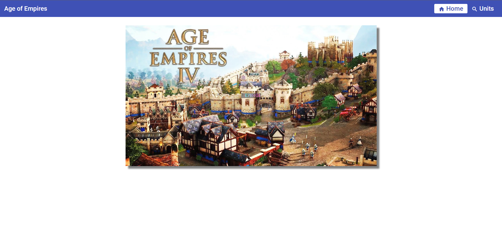
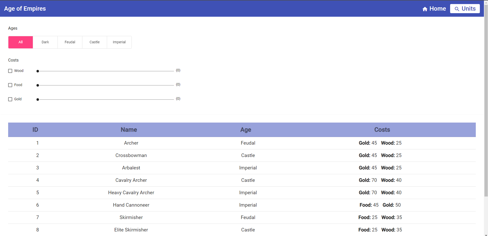
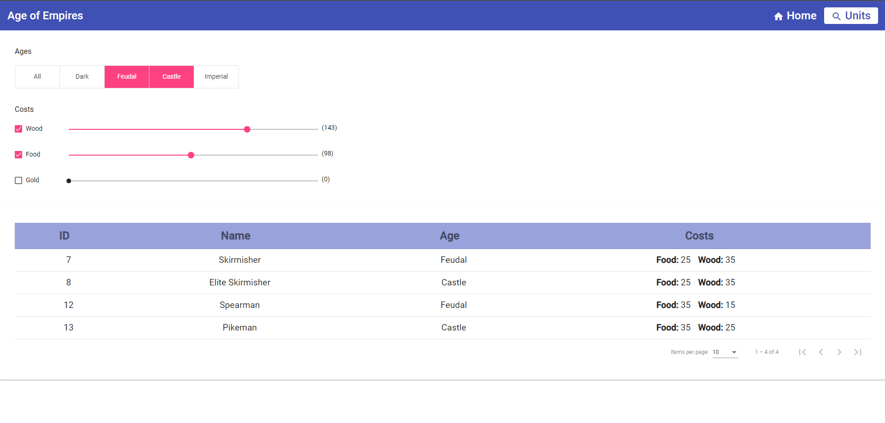
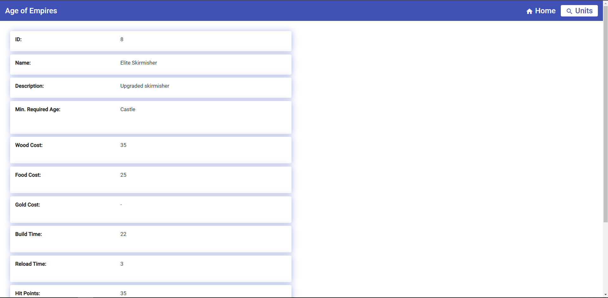
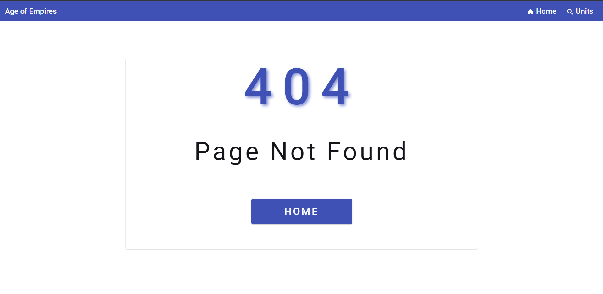

# Age of Empires

This is a code-challenge project to list all the units in the Age of Empires and present the details of any of them.
This project was generated with Angular CLI version 14.0.3.

## Pages

### Home Page

This is the basic home page of this project.

### Units List Page

This is the page used to list the units and filter them by ages or costs simultaneously. To see the details of any unit, just click on the row of a unit.

### Units Detail Page

This is the detail page of the selected unit. It presents the following details: id, name, description, minimum required age, wood cost, food cost, gold cost, build time, reload time, hit points, attack, accuracy.

### "Page Not Found" Page

This is the page when user tries to navigate to an undefined route.

## Development server

Run `ng serve` for a dev server. Navigate to `http://localhost:4200/`. The application will automatically reload if you change any of the source files.

## Code scaffolding

Run `ng generate component component-name` to generate a new component. You can also use `ng generate directive|pipe|service|class|guard|interface|enum|module`.

## Build

Run `ng build` to build the project. The build artifacts will be stored in the `dist/` directory.

## Running unit tests

Run `ng test` to execute the unit tests via [Karma](https://karma-runner.github.io).

## Running end-to-end tests

Run `ng e2e` to execute the end-to-end tests via a platform of your choice. To use this command, you need to first add a package that implements end-to-end testing capabilities.

## Further help

To get more help on the Angular CLI use `ng help` or go check out the [Angular CLI Overview and Command Reference](https://angular.io/cli) page.
